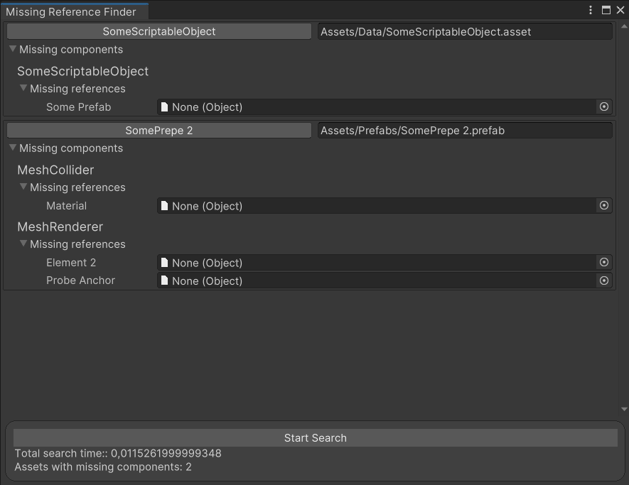

# Missing-References-Finder
Поиск, замена всех потерянных ссылок в одном окне!

# Как работает инструмент
- Собирает все пути к ассетам проекта
- Отсекает все папки, кроме Assets
- Фильтрует по паттерну, в котором будут рассматриваться ассеты,имеющие ссылки на объекты
- Синхронизирует с UIElements

# Приступая к работе

## Открыть окно редактора `Tools/Missing References Finder`

 

## Нажать на кнопку `Start Search`
И начать заменять ссылки\

# Как декомпозировалась задача
Задача была раздроблена на ряд следующих вопросов:
- Как найти пути ко всем ассетам?
- Как их отфильтровать?
- Какие данные нас интересует?
- Каким образом их вычленить?
- Как их представить визуально?

### Почему выбран данный способ прохода по ассетам?
- AssetDataBase.FindAssets(...) - при масштабировании ассетов, время поиска увеличивается [Статья от Unity с доказательство](https://blog.unity.com/technology/tips-for-working-more-effectively-with-the-asset-database).
- AssetDataBase.GetAllPaths() - вариант, который был выбран. Дает возможность удобно профильтровать, отсеять ненужные ассеты.

### Почему UIElements?
IMGUI отлично подходит для разработки `быстрых` и `простых интерфейсов` (пример: fps счетчик), по-этому был отдан выбор в пользу UI Elements, не смотря на его ограничения в `Unity 2020LTS`.

### Почему проект не идеален?
Проблемы, оставшееся в проекте требуют уделения большего времени. Эти проблемы можно пофиксить в будущих версиях, если потребуется необходимость.

### Почему есть закоменченный код?
Для того, чтобы показать, что возможностей функционала должно было быть намного больше.

### Почему инструмент работает с сериализацией, а не проходит по файликам и читает данные напрямую ([hi](https://github.com/AlexeyPerov))
На момент принятия решения удобство работы с сериализацией было достаточным. 

# Как можно улучшить инструмент
- Расширить функционал кнопками по фильтрованию интересующих ассетов.
- Микрооптимизировать алгоритмы поиска ассетов.

# Известные проблемы
- Отсутсвует асихронность.
- На данный момент не анализирует сцены.
- ObjectField'ы принимают в себя тип Object, когда должны тип ассоциированного поля.
- ScrollView можно оптимизировать на прием большого кол-во елементов.
- Отсутствие тестов.

